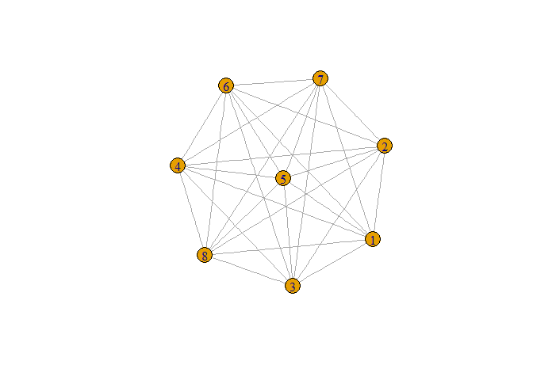

# SNA
RN7  
March 19, 2017  


## R Markdown

This is an R Markdown document. Markdown is a simple formatting syntax for authoring HTML, PDF, and MS Word documents. For more details on using R Markdown see <http://rmarkdown.rstudio.com>.

When you click the **Knit** button a document will be generated that includes both content as well as the output of any embedded R code chunks within the document. You can embed an R code chunk like this:


```r
library(sna)
```

```
## Warning: package 'sna' was built under R version 3.2.5
```

```
## Loading required package: statnet.common
```

```
## Warning: package 'statnet.common' was built under R version 3.2.5
```

```
## Loading required package: network
```

```
## Warning: package 'network' was built under R version 3.2.5
```

```
## network: Classes for Relational Data
## Version 1.13.0 created on 2015-08-31.
## copyright (c) 2005, Carter T. Butts, University of California-Irvine
##                     Mark S. Handcock, University of California -- Los Angeles
##                     David R. Hunter, Penn State University
##                     Martina Morris, University of Washington
##                     Skye Bender-deMoll, University of Washington
##  For citation information, type citation("network").
##  Type help("network-package") to get started.
```

```
## sna: Tools for Social Network Analysis
## Version 2.4 created on 2016-07-23.
## copyright (c) 2005, Carter T. Butts, University of California-Irvine
##  For citation information, type citation("sna").
##  Type help(package="sna") to get started.
```

```r
library(igraph)
```

```
## Warning: package 'igraph' was built under R version 3.2.5
```

```
## 
## Attaching package: 'igraph'
```

```
## The following objects are masked from 'package:sna':
## 
##     betweenness, bonpow, closeness, components, degree,
##     dyad.census, evcent, hierarchy, is.connected, neighborhood,
##     triad.census
```

```
## The following objects are masked from 'package:network':
## 
##     %c%, %s%, add.edges, add.vertices, delete.edges,
##     delete.vertices, get.edge.attribute, get.edges,
##     get.vertex.attribute, is.bipartite, is.directed,
##     list.edge.attributes, list.vertex.attributes,
##     set.edge.attribute, set.vertex.attribute
```

```
## The following objects are masked from 'package:stats':
## 
##     decompose, spectrum
```

```
## The following object is masked from 'package:base':
## 
##     union
```

```r
directdata <- read.table("directed.txt")
indirectdata <- read.table("undirected.txt")
graph1 <- graph_from_data_frame(indirectdata, directed = FALSE, vertices = NULL)
plot(graph1)
```

<!-- -->

```r
g_full <- make_full_graph(8, directed = FALSE)
plot(g_full)
```

<!-- -->

```r
summary(cars)
```

```
##      speed           dist       
##  Min.   : 4.0   Min.   :  2.00  
##  1st Qu.:12.0   1st Qu.: 26.00  
##  Median :15.0   Median : 36.00  
##  Mean   :15.4   Mean   : 42.98  
##  3rd Qu.:19.0   3rd Qu.: 56.00  
##  Max.   :25.0   Max.   :120.00
```

## Including Plots

You can also embed plots, for example:

<!-- -->

Note that the `echo = FALSE` parameter was added to the code chunk to prevent printing of the R code that generated the plot.
