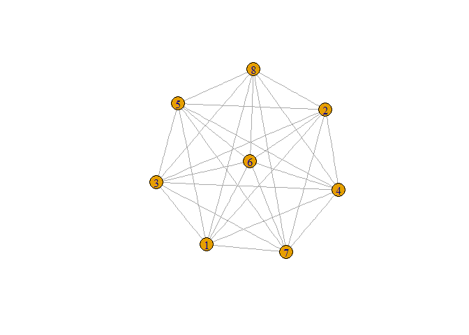
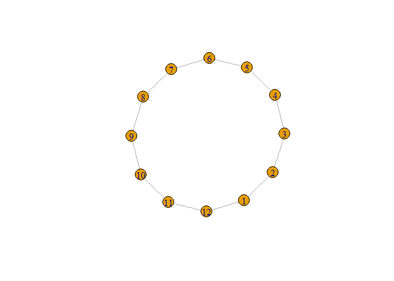
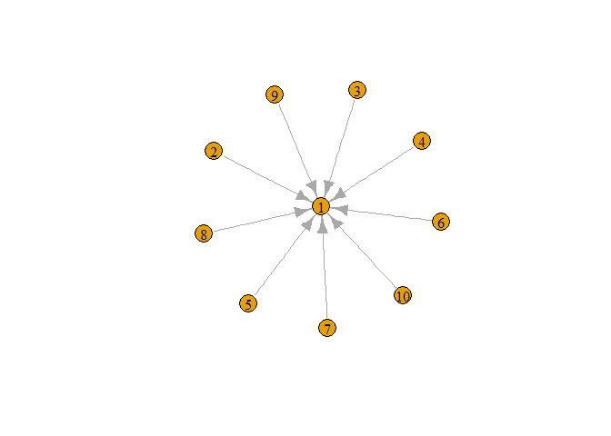
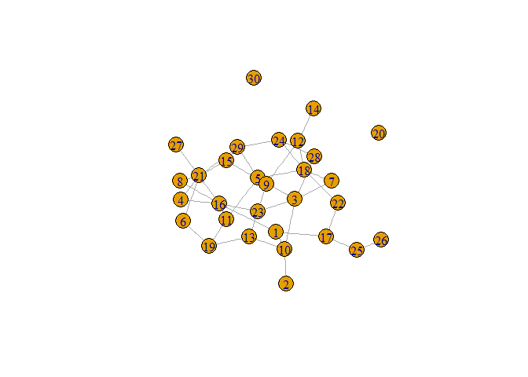

# SNA
RN7  
March 19, 2017  


## Social Network Analysis (test)

Testing social network analysis with the "sna" and "igraph" packages for R using the g(n p) model for
constructing the graphs. 

Without actual data, we can use `sample_gnp` (or `sample_gnm` for the Gaussian network model) to create network graphs with randomized data:


```r
library(sna)
library(igraph)

g2 <- sample_gnp(30, 0.08, directed = FALSE, loops = FALSE) 

plot(g2)
```

<!-- -->

Next we can use the function `igraph()` to customize even more attributes of the SNA graph, be careful as this might get ugly! 


```r
plot.igraph(g2, vertex.label = V(g2)$name, vertex.size = 40,
            vertex.label.color = "yellow", vertex.label.font = 2,
            vertex.color = "darkblue", edge.color = "red",
            vertex.frame.color = "green")
```

<!-- -->

or you can use the `%>%` pipes with the `set_vertex_attr()` or `set_edge_attr()` etc. functions to achieve similar results: 


```r
g3 <- sample_gnp(30, 0.08, directed = FALSE, loops = FALSE) %>% 
  set_vertex_attr("color", value = "red") %>% 
  set_edge_attr("color", value = "black")

plot(g3)
```

<!-- -->

With actual data such as in `undirected.txt`, just load it in using `read.table()`:


```r
indirectdata <- read.table("undirected.txt")

graph1 <- graph_from_data_frame(indirectdata, directed = FALSE, vertices = NULL)

plot(graph1)
```

<!-- -->

How about directed graphs? Simply set `directed =` to `TRUE`: 


```r
directdata <- read.table("directed.txt")

graph2 <- graph_from_data_frame(indirectdata, directed = TRUE, vertices = NULL)

plot(graph2)
```

<!-- -->


Yay.


